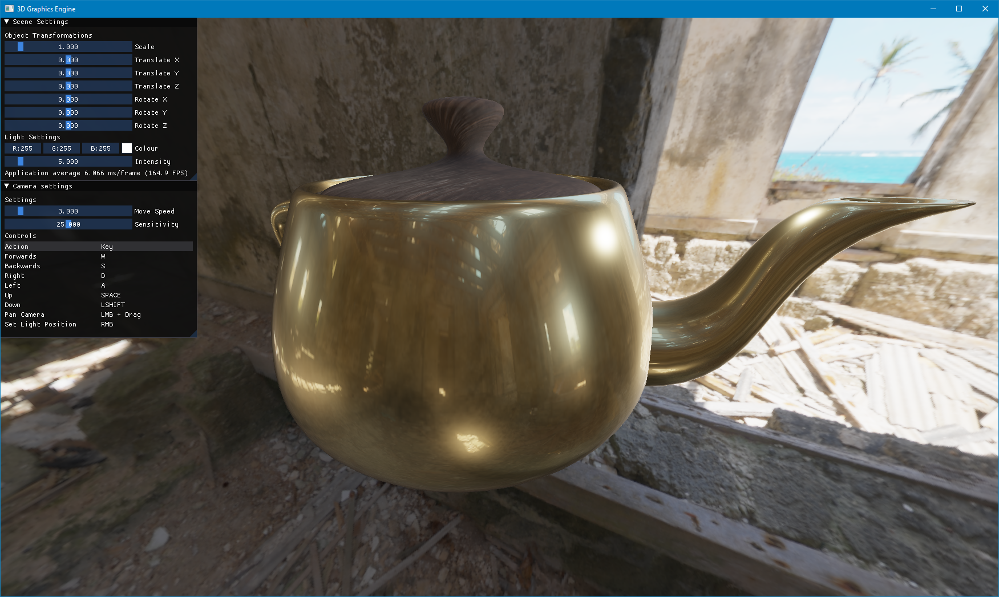
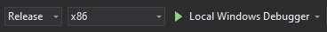
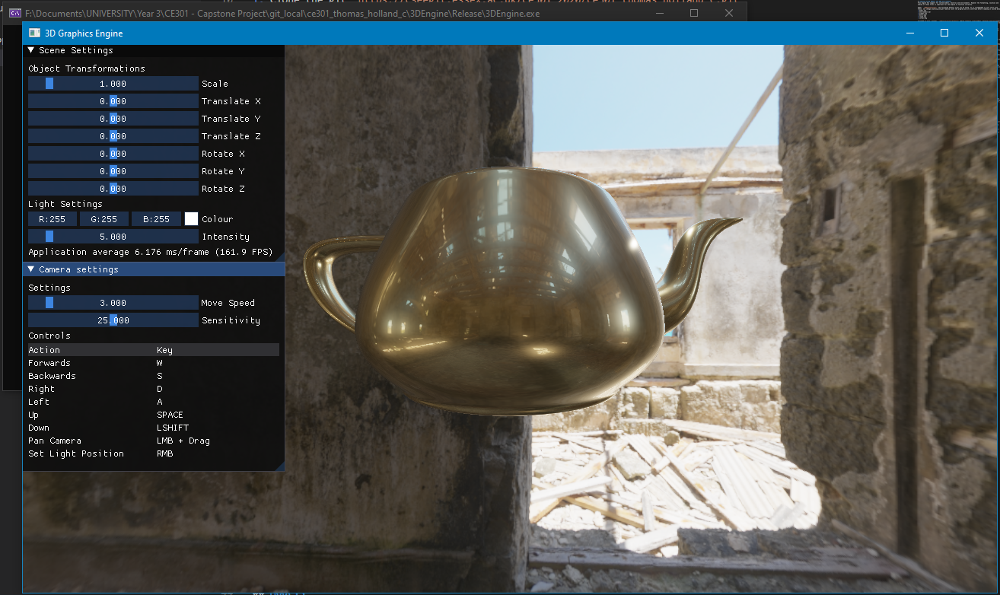

# 3D Graphics Engine
This is a Physically based 3D Graphics rendering engine created using OpenGL and C++. This documentation will cover how to build, run and use the engine.
## Prerequisites
1. Windows 10
2. Graphics drivers with support for OpenGL 4.4 or higher.
3. Microsoft Visual studio 2019 (with the following workloads)
    1. Desktop Development with C++
> Most up to date graphics drivers will support OpenGL 4.4

> Visual studio should prompt for any required workloads / packages automatically.
# Building & Running
Building this project is fairly easy, The most simple way is using Visual Studio 2019.
1. Clone the git `https://github.com/Hololand/University-PBR-Engine.git`
2. Load the solution file `3DEngine.sln` into Visual Studio 2019.
3. Set the build mode to `Release` and `x86`.
4. Run the program using `Local Windows Debugger`

    

After this the following window should be displayed. This window can be resized and maximized freely. The default size is 1280x720.

Alteratively below is a list of dependencies for this project if to be compiled another way. Using `Win32`
* GLEW (2.1.0)
* GLFW3 (3.3.2)
* GLM (0.9.9.8)
* SOIL (1.20)
* ImGUI (1.82)

> All dependencies are already included under "./3DEngine/Linking" and "./3DEngine/src/vendor".

# Usage
Using the program is fairly simple. However it is important that the requirements for loading custom data is followed strictly. This below section will cover everything necessary to use the various features of the program and load custom data to be rendered.

# Loading custom Models and HDR environments
This engine has support for custom models, textures and environments. However the formatting, location and naming of these files is important for the engine to function correctly.

Under `./3DEngine/Assets/` the following default files can be found. It is recommended to just start with these, not change anything and get familiar with the program and its interface before loading in custom data.
* model.obj
* environment.hdr
* albedo.png
* metal.png
* rough.png
* normal.png

Included is also a folder `./3DEngine/Assets/Examples/` Which contains a few models, textures and environments that can be used. Using different assets is simply a case of replacing the default files with the ones to be loaded. Keeping the same name and extension. Below is a more in depth explanation of this.

## Models
For loading custom 3D models, this engine supports the standard `.obj` file format. The OBJ's must contain triangulated faces, Texture coordinates and Normals. To to load an object it must be named `model.obj` and replace the default file in the `./Assets/` folder.
> The '.mtl' material extension is not supported.

> If the asset appears oriented wrongly, Try flipping the OBJ's YZ axis (Poser-like)

> Some assets may be large and not directly visible on import due to backface culling, Try flying around a bit or scaling the object down.
## Environment
Any environment map can be loaded to customize the skybox and ambient lighting of the scene. Environment maps should come in the `.hdr` file format. Any `.hdr` environment map can be loaded but must must be named `environment.hdr` and replace the existing HDR image in `./Assets/`.
## Textures
There are four textures that this engine supports for PBR (Physically Based Rendering). `albedo` Which contains the colour information, `metal` which contains information for how metallic an object is, `rough` which contains the roughness information for the object. And `normal` which contains normal information for the object. Each of these images must be in `.png` format and with names that exactly mimic those already existing in the `./Assets/` folder.

For this engine to function correctly it is **necessary** that **all** of the files listed above are present. The contents of these files does not matter provided they meet the above listed requirements.

# Controls / Interface
Using the program is very simple and intuitive, There are some basic controls for navigating the scene that will be described below, There are also two windows that allow some customization of the scene which will also be described below.

## Controls
The controls are very simple and listed at the bottom of the Camera Settings panel in the GUI.
The camera can be moved using the standard `W`, `A`, `S`, `D` controls for horizontal movement. For vertical movement the camera can be elevated with `SPACE` and lowered with `LEFT SHIFT`. Additionally for rotating the camera `LEFT MOUSE BUTTON` can be held in combination with dragging the mouse where the X,Y movements of the mouse correlate to the Yaw and Pitch of the camera respectively.
| Action            | Key                       |
| ------------------| --------------------------|
| Forwards          | W                         |
| Backwards         | S                         |
| Right             | A                         |
| Down              | D                         |
| Elevate           | SPACE                     |
| Lower             | LEFT SHIFT                |
| Pan Camera        | LEFT MOUSE BUTTON + DRAG  |
| Set Light Position| RIGHT MOUSE BUTTON        |

## Camera settings
Using the sliders found in the `Camera Setting` window, The camera speed and sensitivity can be adjusted to the users preference. `Move speed` defaults to `3.0` but can be increased to increase the amount the camera moves in response to `W`, `A`, `S`, `D`, `SPACE`, `LSHIFT` movement controls. The default `Sensitivity` is `25.0`. Increasing this will increase the amount the camera rotates in response to mouse input.

## Scene Settings
The scene settings windows contains controls to manipulate light and objects in the scene. It also at the bottom contains an FPS counter that tracks the average frame time and frames per second of the scene.

> note that technologies such as Nvida G-Sync and AMD's FreeSync can limit FPS to monitor refresh rate.

There are two key sections to the Scene Settings window which will be described below.

### Object transformations
The model in the scene can be transformed using the `Scale`, `Translate X`, `Translate Y`, `Translate Z`, `Rotate X`, `Rotate Y`, `Rotate Z` sliders in the `Scene Settings` window. Where Y is the up axis. The `scale` acts as a multiplier with a default value of `1.0`. The translations and rotations default to `0.0` with rotations ranging from `-180.0` to `180.0`. This allows for a full 360 degrees of rotation across all axis.

### Light settings
The Light object in the scene can be moved to the camera position using the Right mouse button. The `Colour` of the light can be set to any 24bit RGB value with a default of pure white `R:255`, `G:255`, `B:255`. The intensity of the light can be adjusted using the `Intensity` slider. It starts with a default value of `5.0`.